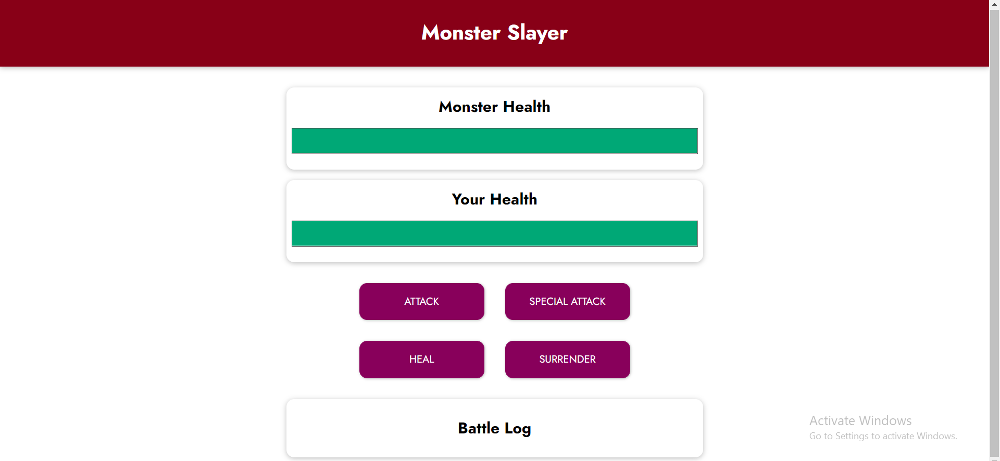
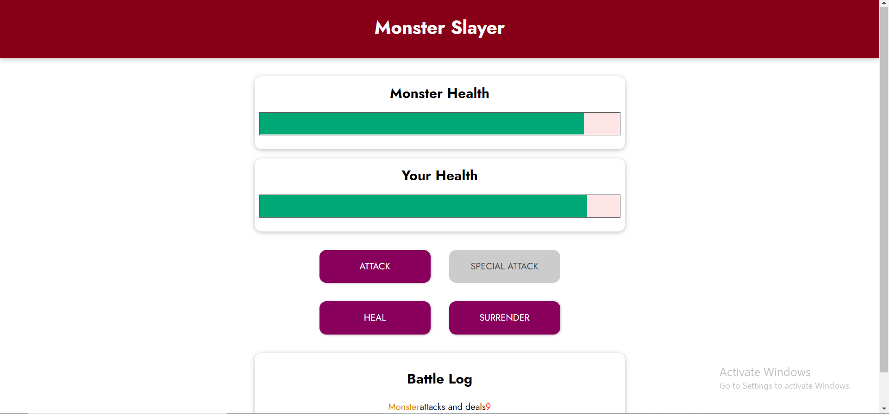
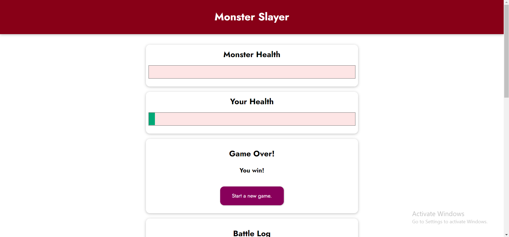
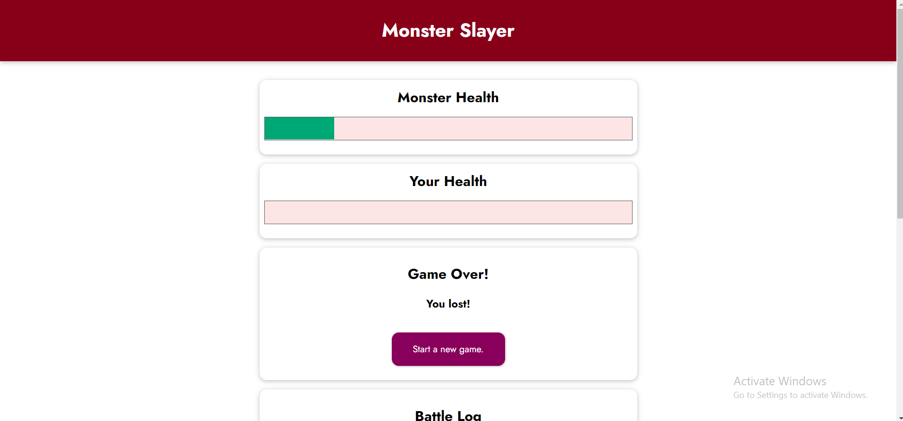
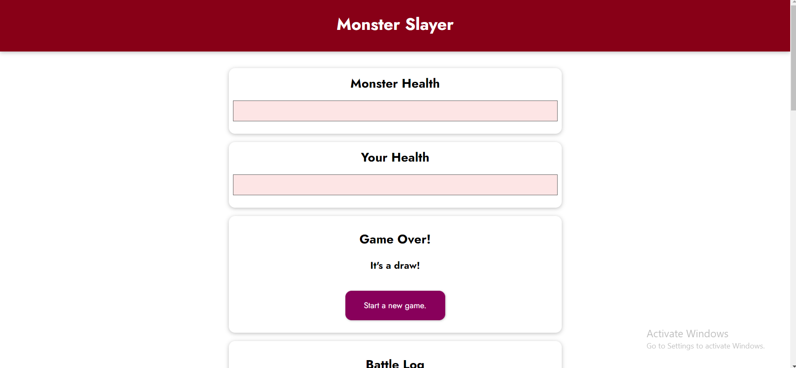
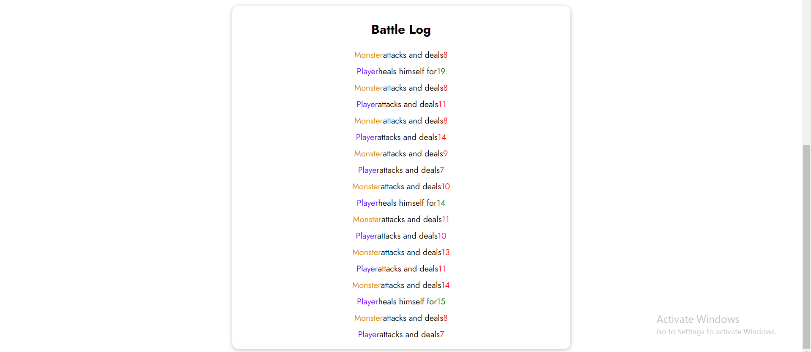

# Monster Slayer Game

## Table of contents:

- [About](#about)
- [Game Description](#gamedescription)
- [ScreenShots](#screenshots)

## About

It's a simple interactive game built using VeuJS.
It covers all core concepts in VueJS like (Data Binding, Event Binding, Computed Properties, Watchers, Dynamic Styling, Rendering Content Conditionally, Rendering List of Data, ...etc).

## Game Description

- The game starts with a player and a monster, each of them has a 100% health.
- There are 4 buttons for the player to use:
  - Attack: The player attacks the monster and then the monster attacks him back with more power (When one of them is attacked, his health is reduced).
  - Special Attack: Same as Attack but with power more than the monster's power and because of this, this button can be used once each 3 rounds.
  - Heal: The player can heal humself but the monster will attack him back again.
  - Surrender: The player gives up and the monster will be the winner.
- There are 3 possible results for the game:
  - You win! (When the monster's health becomes 0).
  - You lost! (When the player's health becomes 0).
  - It's a draw! (When the both's health becomes 0).
- When The game is finished, the control buttons are hidden and a new button is provided to start a new game.
- There is a Battle Log to show the steps through the game.

## ScreenShots

### Game starts:

### Special Attack unenabled:

### Game results:

### Battle Log:

